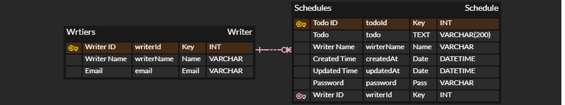
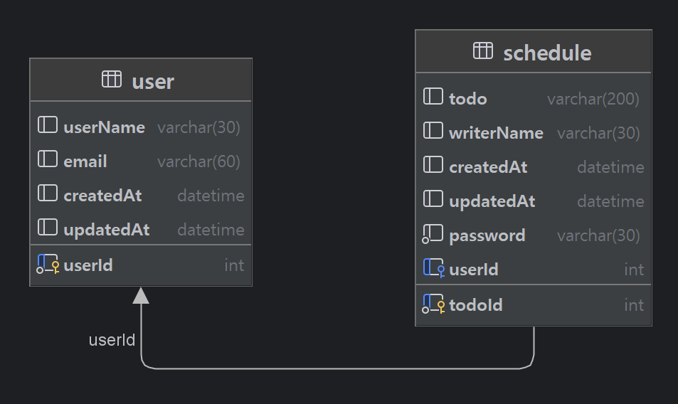

# Schedule

### Schedule 을 관리하기 위한 CRUD 기능  

### 가능한 요청 목록  
#### -- 스케줄 관련 요청 --  
Create Todo : 스케줄 생성  
Get TodoList : 스케줄 목록 조회  
Get Todo : 단건 스케줄 조회  
Update Todo : 스케줄 수정  
Delete Todo : 스케줄 삭제  
#### -- 유저 관련 요청 --  
Register User : 유저 등록(생성)  
Get UserList : 유저 목록 조회

API Documentation:  https://documenter.getpostman.com/view/44617331/2sB2jAaTUz

시작 전 ERD  

완료 후 ERD

### 사용한 프레임워크  
Spring Boot

### 추가한 Dependencies (build.gradle)  
implementation 'mysql:mysql-connector-java:8.0.28'  
implementation 'org.springframework.boot:spring-boot-starter-data-jdbc'  
implementation 'jakarta.validation:jakarta.validation-api:3.0.2'  
implementation 'org.hibernate.validator:hibernate-validator'